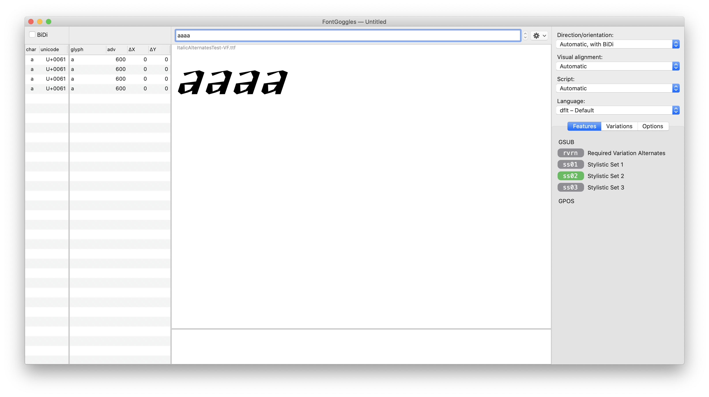
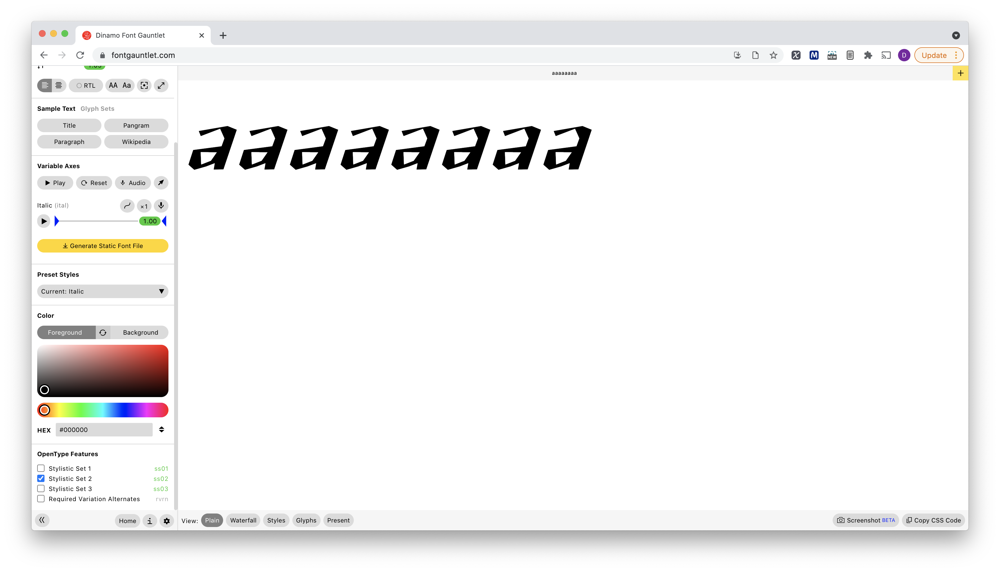

# Italic Alternates Test

This test font documents a problem in Adobe apps where an alternate cannot be substituted correctly once a Feature variation (`rvrn`) is applied. 

I am testing with MacOS 10.15.7 in InDesign 16.2.1. Illustrator 25.2.3.

In this demo, the lowercase `a` is substituted by an italic variant at .5 on the `ital` axis.

The Stylistic Sets are:

* Stylistic Set 01: Substitute default `a` with italic `a` (applies italic feature variation without italicizing)
* Stylistic Set 02: Substitute italic `a` with default `a` (undoes italic feature variation)
* Stylistic Set 03: Substitute default `a` with a second alternate that is not included in a feature variation (upright a with no counterform)

The unexpected behaviors are as follows:

When I try to apply the `ss02` alternate to an individual glyph, nothing happens. It does work when the feature variation is not applied, and when I use the `ss03` alternate. I would expect all stylistic sets to apply their intended alternate.

I am not able to apply stylistic sets to a selection. I would expect to see the stylistic sets listed here and to be able to check them to apply them to a selection.

When I use the same font in other apps or browsers, the stylistic sets are available and apply correctly.

Thank you!